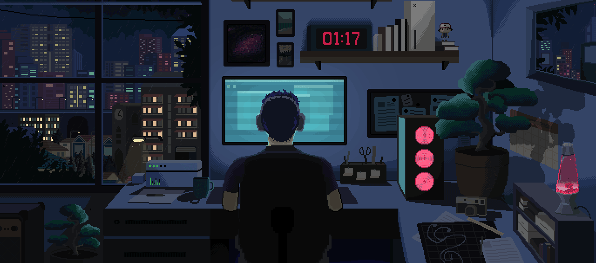

<h1 align="center"><strong>💻 Raja Hamid</strong> | Flutter Architect</h1>

  

  
  
  
  
  
  

  

  

---

<h1 align="center">🚀 Digital Craftsmanship</h1>

I am a dedicated **Flutter Developer** with **2+ years** of experience in designing and developing robust, scalable mobile applications. My expertise spans across a diverse set of technologies, including:

- 🔥 **Mobile Excellence:** Crafting intuitive, responsive user interfaces with **Flutter** and **Dart**.
- 🎯 **State Management & Architecture:** Leveraging modern solutions such as **Riverpod**, **BLoC**, and **getx** to build efficient, maintainable applications.
- 🤖 **AI & Image Processing:** Utilizing **OpenCV** (with C++) to develop advanced features like facial recognition and number plate detection.
- 🌐 **Backend & Web Integration:** Integrating **Firebase** for real-time data and authentication, along with proficiency in **HTML**, **CSS**, and **JavaScript** for web development.

**Current Quest:** Developing a real-time AR navigation system using Flutter in combination with OpenCV to create innovative and interactive experiences.

---

<h1 align="center">⚡ Tech Nexus</h1>

### **Core Stack**

  
  
  

### **Development Ecosystem**
<table width="100%" align="center">
  <tr>
    <td width="33%" align="center">
      <strong>Frontend</strong> 
      
      
      
      
    </td>
    <td width="33%" align="center">
      <strong>Backend</strong> 
      
      
      
      
      
      
    </td>
    <td width="33%" align="center">
      <strong>Tools</strong> 
      
      
      
      
      
    </td>
  </tr>
</table>

---

<h1 align="center">📊 Code Chronicles</h1>

   
  

  

---

<h1 align="center">📜 Wisdom Scroll</h1>

  

---

<h1 align="center">🐍 Contribution Snake</h1>

---