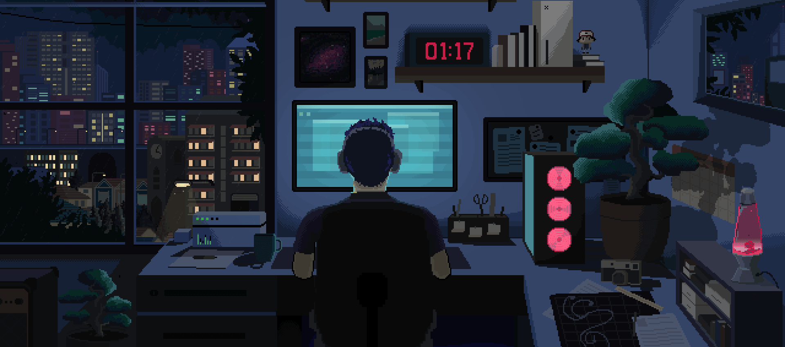

<!-- HERO SECTION -->

  

 

  
  
  
  
  
  

  

 

<!-- ELEGANT SEPARATOR -->

 

## 🌟 **About Me**

  

I'm <strong>Raja Hamid</strong>, a <strong>Flutter Developer</strong> with over <strong>2 years</strong> of experience delivering high-performance, scalable mobile applications. I combine strong technical foundations with a keen eye for design to produce polished, user-centric digital products.

💡 <strong>Core Competencies</strong> 
• Cross-platform mobile development with <strong>Flutter & Dart</strong> 
• Scalable state management using <strong>BLoC</strong>, <strong>Riverpod</strong>, and <strong>GetX</strong> 
• Real-time data integration with <strong>Firebase</strong> 
• Computer vision applications leveraging <strong>AI & OpenCV</strong> 
• Backend development with <strong>Node.js</strong> and cloud infrastructure 
• Workflow automation with <strong>Zapier</strong>, <strong>n8n</strong>, and <strong>GoHighLevel</strong>

🎯 <strong>Current Focus:</strong> Developing an <em>AR Navigation System</em> using Flutter and OpenCV for real-world spatial interactions.

 

 

## 💎 **Technical Skills**

### **Core Technologies**

  
  
  
  

### **Development Ecosystem**

<b>🎨 Frontend & UI</b>

 

  

<b>⚡ Backend & Databases</b>

 

  

<b>🛠️ Tools & DevOps</b>

 

  

<b>🧠 AI & Computer Vision</b>

 

  

<b>🤖 Automation & Workflow</b>

 

  
  
  

 

 

## 📊 **GitHub Analytics**

### **Contribution Snake**
<picture>
  <source media="(prefers-color-scheme: dark)" srcset="https://raw.githubusercontent.com/Raja-Hamid/Raja-Hamid/output/github-contribution-grid-snake-dark.svg">
  <source media="(prefers-color-scheme: light)" srcset="https://raw.githubusercontent.com/Raja-Hamid/Raja-Hamid/output/github-contribution-grid-snake.svg">
  
</picture>

 

 

<!-- FOOTER -->

**If you find my work valuable, a ⭐ on any repository is always appreciated.**

